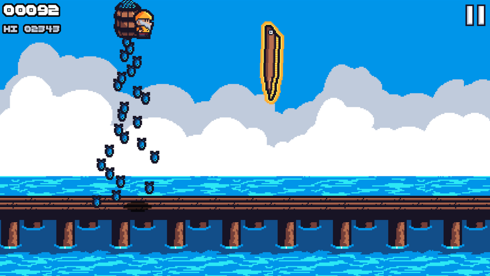

# Fisher's Flight

This is a Jetpack Joyride style game created using the Godot engine as part of the [20 Games Challenge](https://20_games_challenge.gitlab.io/challenge/).

## Controls

| Action | Key              |
| ------ | ---------------- |
| Fly    | Left Mouse Click |
| Pause  | Escape           |

## Credits

### Programming and Art

- Me

### Audio

- Jetpack Joyride

- OldSchool RuneScape

- [Helton Yan](https://heltonyan.itch.io/)

### Fonts

- [Not Jam](https://not-jam.itch.io/not-jam-font-pack)
